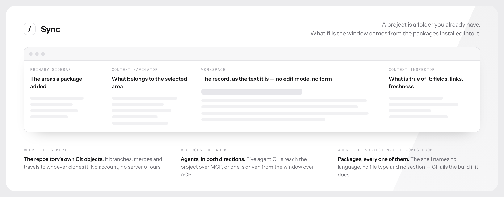

<div align="center">

# Sync

### A desktop environment where agents do the work

[](https://github.com/sync-buzz/sync/releases/latest)
[](#install)
[](./LICENSE)
[](https://www.npmjs.com/package/@sync-buzz/extension-api)

**[⬇&nbsp; Download for macOS](https://github.com/sync-buzz/sync/releases/latest/download/Sync_macOS_aarch64.dmg)**
· [sync.buzz](https://sync.buzz)
· [Write an extension](docs/extensions.md)
· [How it is put together](docs/architecture.md)

</div>



**Open a folder on your Mac and it becomes a project.** The agent you already
use works inside it, and everything the project learns is written to that
folder's own Git repository — where it branches, merges, travels to whoever
clones it, and belongs to you.

**What kind of work is up to you.** Sync is a shell. It holds what every kind of
work needs — projects, the agents that act on them, the permissions those agents
run under, a clock that keeps going when the window is closed, and a store of
what the project knows that says when it has gone out of date. What a project is
*about* comes entirely from the packages installed into it.

**No package is privileged.** The three Sync ships with arrived the way yours
will: built outside this repository, declared in a manifest, installed into a
project that asked for them. There is no `src/extensions/` directory here and CI
fails the build if one appears, so the shell cannot name a section in a type or
a constant even by accident. That rule is the whole design — it is what makes
the environment yours to shape rather than ours to extend on your behalf.

**What the shell guarantees, so a package does not have to:**

- **A project is a repository**, and everything it knows is written to that
  repository's own Git objects. It branches, merges, travels to whoever clones
  it, and belongs to you. No account, no server of ours.
- **What it knows says when it has rotted.** A record names the files its claim
  is about; the engine reconciles them against the repository's history and
  marks the claim `stale` when they move. Not a review date somebody set and
  forgot — derived, every time it is read.
- **Agents, in both directions.** Connect Claude Code, Codex, Gemini CLI, Grok
  or OpenCode over MCP and they work against the project. Or drive one *from*
  the window over ACP, with its plan, its tool calls and its permission prompts
  drawn as part of the interface.
- **Work outlives the window.** A package can declare handlers on a clock and
  order work that runs with nothing open, under permissions it declared and a
  person approved, attributed to whoever asked for it.

Structured knowledge that stays honest, agents that act on it, and an
environment you assemble rather than accept.

> **Pre-1.0 and under active development.** Used daily on the machine it is
> built on, and not finished. What is here works; what is absent is absent
> rather than stubbed. See [Where it stands](#where-it-stands).

## Install

| | |
| --- | --- |
| macOS 13+ (Apple silicon) | [**Sync_macOS_aarch64.dmg**](https://github.com/sync-buzz/sync/releases/latest/download/Sync_macOS_aarch64.dmg) |

**macOS only, deliberately.** The window is drawn against macOS materials — the
`underWindowBackground` material behind the frame, the title bar the header
occupies, the traffic lights placed by hand, the Dock menu, the system speech
synthesiser. Some of that degrades honestly on other platforms and some of it
does not, and nobody has yet launched a Linux or Windows build to find out
which. Shipping an installer nobody has opened would be a worse answer than
shipping none. The pipeline still builds one from a single matrix row —
see [docs/releasing.md](docs/releasing.md).

Sync updates itself: it looks once at each launch, verifies what it finds
against a key compiled into the binary, installs it and says nothing. The next
launch is the new version, and the menu bar item offers a restart to anybody who
would rather not wait. Nothing about that flow is reachable from the window's
content.

**Upgrading from the earlier Sync?** Read [If you came here looking for the old
Sync](#if-you-came-here-looking-for-the-old-sync) first: the two share no
settings and no data, and one thing does break on the agent's side.

## What that looks like in practice

**Four freshness states, and the engine derives every one.** `fresh`,
`unverified`, `stale`, `invalid` — never typed in, never a field somebody
maintains. `stale` means the paths a record named have moved since it was
written. The navigator counts them, so a project can be read by how much of what
it knows is still load-bearing.

**A record opens as the text it is.** No edit mode, no form: the caret goes
where you clicked and typing changes the record, title included. Markdown is the
format, so Markdown decides the feature set — and a body that would not survive
the round trip is shown read-only with the reason, rather than silently mangled.

**The schema is the project's, published at runtime.** The window knows nothing
about what a field means: an enumeration draws a picker, a flag draws a
checkbox, a relation offers exactly the targets the type declares. Add a type
and the interface follows without a line changing here.

**Removing has two meanings and both are offered.** Archive is reversible and
keeps every link. Delete first says what holds on to the record, in two numbers
— what links to it, and what mentions it in prose — because a record that named
this one is somebody's reasoning, and taking it silently would take the
reasoning with the conclusion.

**Connect an agent with one control.** Claude Code, Codex, Gemini CLI, Grok and
OpenCode. Sync writes exactly one server entry into that agent's own
configuration and touches nothing else in the file; disconnecting takes exactly
that entry back out. Or drive one *from* Sync over ACP, in the window, with its
plan, its tool calls and its permission prompts drawn as part of the interface.

**It talks to nothing else.** No account, no telemetry, no analytics, no crash
reporting — absent, not off by default. The application makes two kinds of
outward request on its own: the update check, and the extension registry when
you open the catalogue. Both go to GitHub, both are made in Rust with the
reachable hosts compiled into the binary, and the webview is granted no
`connect-src` at all.

## How a project works

A project is a Git repository. Sync keeps what a project knows in the
repository's own refs, so a folder outside version control has nowhere to put
any of it.

Opening a folder asks as little as it can:

1. Not a repository? It says why that is a problem and offers `git init`.
   Declining ends the flow.
2. Already carries a project record? That is the whole flow — it opens with the
   name, description and language it was given the first time. Nothing is asked.
3. Otherwise it asks for those three, then shows the catalogue of extensions.

**A project's settings live in the project**, as the `project` record in the
repository's own memory, written in the same transaction that publishes the type
corpus. The only thing kept on this machine is the list of recently opened
projects; losing it costs a shorter menu and nothing else.

## Everything a project can do is a package

Sync is a shell. **There is no `src/extensions/` directory in this repository**,
and CI fails the build if one appears — Records, Chat and Project memory are
packages like any other, built elsewhere, installed through the same path a
stranger's extension is installed through. That rule is the whole design: a
window that could name one section in a type or a constant would treat that
section differently from yours.

A package declares what it needs, and a build publishes what it can do. The ten
capabilities today:

`records` · `agents.acp` · `markdown.plugins` · `native-menu` · `folders` ·
`sheets` · `net` · `background` · `schedule` · `work.agent`

A missing one is a refusal with a sentence a person can act on, never a silent
degradation. `net` is the one that is a capability *and* a list: a package that
wants the network names the exact hosts, without wildcards, and every redirect is
checked against the same list.

**This is where contributions are most welcome.** You do not have to work on the
core to add something real — an extension is a package with its own types, its
own screen, its own background work and its own clock, and it installs into any
project without this repository changing:

- The contract is published as [`@sync-buzz/extension-api`](https://www.npmjs.com/package/@sync-buzz/extension-api).
  It carries the types, the version your manifest states a range against, and a
  CLI that packs and checks an archive.
- The three packages Sync ships with are built in
  [sync-buzz/sync-extensions](https://github.com/sync-buzz/sync-extensions) and
  are worth reading as worked examples.
- [docs/extensions.md](docs/extensions.md) is the whole of how a package is
  built, loaded, permitted, published and updated.
- [docs/background.md](docs/background.md) is the half of an extension that runs
  with no window open.

Ideas that need nothing from us: an issue tracker over your forge, a reader for
a document format, a review surface, a dashboard over a type you invented.

## Where it stands

**Working:** the shell and both windows; opening a folder as a project; types,
records, folders and the document editor; the context panel; search; the memory
engine, its sync, merge and rewind; the MCP interface and connecting an agent to
it; ACP conversations with five agent CLIs; the extension format, loader,
registry, marketplace and updates; background service modules and their clocks;
the system speech synthesiser; self-updating releases.

**Nothing in the interface is a stub.** There are no disabled controls, no
cards that say "soon" and no sections that open onto an explanation of what will
one day be there. What you can see, you can use; what a project cannot do yet is
a package nobody has written.

**Known rough edges** are the ones a first release has: the extension catalogue
is small, packages are not yet signed — the format and the verification are
there, the key is not — and the memory engine is a young dependency on its own
release cadence.

## If you came here looking for the old Sync

A different application used to live at this address. It is preserved,
unmaintained, at **[sync-buzz/sync-legacy](https://github.com/sync-buzz/sync-legacy)**,
and its releases are still downloadable there.

**This is not a new version of it.** It is a different application with a
different data format, and there is no migration — nothing here reads what that
one wrote. If you are using it, it goes on working exactly as it does today:
copies in the field will **not** be updated to this, deliberately and by three
independent mechanisms. The two were signed with different keys, so a build from
this repository is not merely unwanted by an old copy but unverifiable by it.
The reasoning is in [docs/releasing.md](docs/releasing.md).

**They do not share settings or data.** The two bundles carry different
identifiers — `buzz.sync` here, `chat.sync.desktop` there — so macOS treats them
as separate applications and neither reads the other's configuration directory.

**Installing this one replaces that one.** Both bundle as `Sync.app` and want
the same path in `/Applications`, so there is no side-by-side unless you rename
one in Finder first. What gets replaced is the application; the old one's data
sits under its own identifier and is untouched, though nothing here can read it.

**One thing does break, and it is worth knowing before you install.** If you
connected an agent to the old Sync, that agent's configuration names a program
inside the bundle — `Sync.app/Contents/MacOS/git-sync` — and replacing the
bundle takes it away. From the agent's side the server simply stops starting.
This build serves the same purpose from a different program in the same place,
`sync-mcp`, and it will **not** quietly rewrite the entry: an entry under Sync's
name that points somewhere else is reported to you rather than overwritten,
because somebody else's configuration file is not ours to tidy. Open
**Settings → Agents** after installing and connect again; it is one control per
agent.

## Building it

Prerequisites: macOS 13+, Xcode Command Line Tools, Node.js 20.9+ (developed on
23.11), pnpm 11 (`corepack enable` picks up the `packageManager` field), and
Rust stable.

```sh
pnpm install       # from the lockfile
pnpm tauri dev     # build and run the application
pnpm tauri build   # produce the installer

pnpm lint          # eslint
pnpm typecheck     # tsc --noEmit
pnpm api:check     # the extension surface, and the number it is promised under
pnpm build         # static export to ./out
```

For the Rust side, from `src-tauri`:

```sh
cargo fmt --all -- --check
cargo clippy --workspace --all-targets -- -D warnings
cargo test --workspace
```

**Build the memory sidecar before bundling.** `sync-mcp` ships inside the bundle
as a Tauri `externalBin`; it *links* the memory engine as a library rather than
spawning it, and serves two callers over stdio — an agent gets MCP, the window
gets a channel of product operations that is not MCP and appears in no
`tools/list`.

```sh
./scripts/prepare-sidecar.sh                        # build it from this workspace
./scripts/prepare-sidecar.sh --from /path/to/binary # stage one already built
```

The engine is pinned to a tag in `sync-mcp`'s manifest and resolved from GitHub
like any other dependency, so a clean checkout builds exactly what a release is
cut against and needs no directory beside it. In development, point Sync at your
own build with `SYNC_MCP_BINARY=/path/to/sync-mcp` — there is no search of
`PATH`, because a stray `sync-mcp` would carry a different engine inside it and
nothing would say so.

### Two constraints worth knowing before you write code

**Next.js is a build system here, never a server.** `output: "export"` makes the
whole application a folder of static assets that Tauri embeds. Nothing needing a
Node.js runtime after packaging can be used: no SSR, no Route Handlers, no
Server Actions, no middleware, no rewrites or headers, no image optimizer. System
access arrives through Tauri commands.

**The Mac App Store is ruled out.** The native `underWindowBackground` material
requires a transparent window, which on macOS requires `app.macOSPrivateApi`, and
an application built on a private API cannot be published there. Distribution is
direct. The reasoning is in
[docs/design-foundation.md](docs/design-foundation.md).

Two dependencies are deliberately **not** on their newest major: TypeScript,
because `typescript-eslint` (via `eslint-config-next`) does not yet accept the
next one, and ESLint, because `eslint-plugin-import`, `eslint-plugin-jsx-a11y`
and `eslint-plugin-react` declare support only through 9. Both are pinned in
`pnpm-lock.yaml`; revisit when the upstream configs catch up.

## Documentation

- [docs/design-foundation.md](docs/design-foundation.md) — the visual system,
  the panel roles, and the rules for changing them. **Read this first** before
  touching the window.
- [docs/architecture.md](docs/architecture.md) — how Tauri, Next.js, the Rust
  crates and the memory process fit together
- [docs/extensions.md](docs/extensions.md) — what a package is, how the window
  decides it may run one, where packages come from, and how one is updated
- [docs/background.md](docs/background.md) — work that runs with no window open
- [docs/voice.md](docs/voice.md) — what the application says out loud, and who
  may ask it to
- [docs/releasing.md](docs/releasing.md) — cutting a release, and the separate
  act that ships it to installed copies

`AGENTS.md` is the short version for a coding agent working in this repository.

## Licence

[Functional Source License 1.1, MIT Future License](./LICENSE) — source-available.
Use it, modify it, redistribute it for any purpose except building a product or
service that competes with Sync; internal use, education and research are named
as permitted. Each version becomes plain MIT two years after it is released.

## Security

Please report a suspected vulnerability privately to **security@sync.buzz**
rather than in a public issue. [SECURITY.md](./SECURITY.md) also describes what
this application reaches and what it deliberately does not.
