# Extension architecture

The map of the seam. [`extensions.md`](extensions.md) is the reasoning — what
was chosen, what it was chosen over, and what goes wrong when a rule is broken.
This is the same subject drawn rather than argued: the boundaries in order, the
manifest field by field, each lifecycle as a sequence, and the refusals with the
place each one is heard.

It describes the version that exists. Where a number is stated it was read out
of this tree — `SYNC_API_VERSION` is `3.3.0`, and the capability list in §8 is
`SYNC_CAPABILITIES` in full.

## How to read this

Two readers, one document, and they enter it at different places.

| If you are | Start at | Because |
| --- | --- | --- |
| Writing an extension | §3, then §4, then [`writing-an-extension.md`](writing-an-extension.md) | The two halves of a package, then every field you may write |
| Changing the host | §2, then §13 | The four checks in order, and what may not stop being true |
| An agent asked to add something | §13, then §14 | The invariants first, then the file that answers each question |
| Deciding whether to install one | §8, then §9 | What each capability agrees to, and what is left on the disk |
| Handling a token | §8a | The address, the two roads, and the rule that is yours to keep |
| Debugging a package that will not run | §12 | Symptom, cause, and the file that produced the sentence |

---

## 1. One sentence, and the diagram under it

**Sync is a shell with no subject matter, and everything a project is about
arrives as an archive the application did not build.**

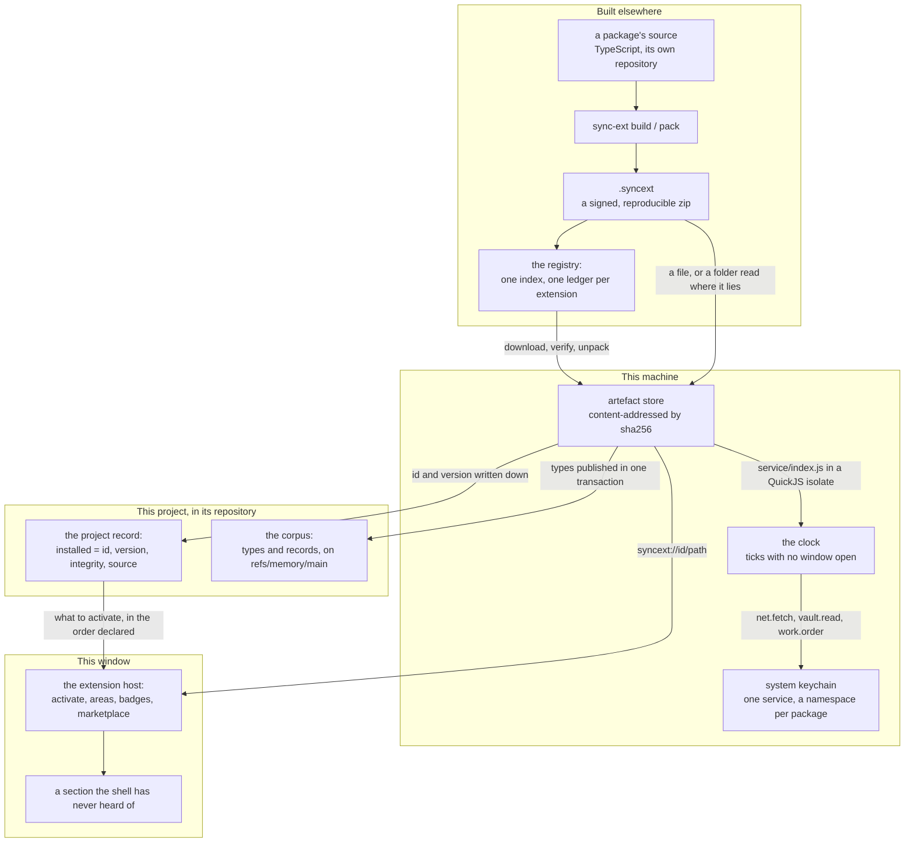

Three things in that picture are worth saying in words, because they are the
ones a reader assumes wrongly:

- **The project declares, the machine holds.** An artefact is shared by every
  project on the machine and named after its own hash; what a project carries is
  a pointer and the hash it expects. That is what makes the declaration a
  lockfile and re-installing free.
- **The window is not the only thing that runs a package.** A handler runs with
  every window closed, and the clock that calls it is in Rust.
- **Nothing in the shell knows what any of it is about.** There is no
  `src/extensions/`, no constant naming a section, no type union of ids. A job
  in CI fails a tree that has one.

---

## 2. Four boundaries, and each has its own refusal

The order is the design: each check is cheaper and says more than the one after
it, so by the time anything of a package is executed the only failure left is
the package's own.

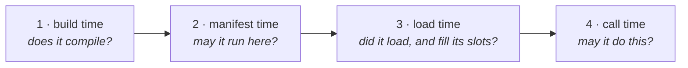

| | Boundary | When | What is checked | Who refuses | What the author sees |
| --- | --- | --- | --- | --- | --- |
| 1 | **Build** | `sync-ext build`, in the author's terminal | Imports resolve against the published contract; the module runs against a stand-in host and what it returns is compared with what the manifest declared | The CLI | A failing build |
| 2 | **Manifest** | Reading `manifest.json` — by the packer, by CI, by Rust, by the schema | Field shapes; `engines.syncApi` against `SYNC_API_VERSION`; every capability against `SYNC_CAPABILITIES`; `net` and its hosts together; kind prefixes; a declared frame; a handler for every occasion | `sync-extensions`, before anything is unpacked | A card that says *needs a newer Sync*, or names the capability |
| 3 | **Load** | The window activating what the project declared | The module fetched over `syncext://` under the policy; `activate` returning one entry per declared area; every slot the frame has, and no slot it has not | `extension-host/activate.ts` | The section is absent and the card carries the reason |
| 4 | **Call** | While a handler or a panel is running | `net.write` for a verb that is not `GET` or `HEAD`; `vault` for a secret; `work.agent` for an order; a host it did not name; a redirect off the list | Rust, at the call | A refusal the code can catch, in words |

**Why call time exists at all.** Two of those questions cannot be answered from
a file. Which HTTP verb a package uses on a given day and whether it ever
touches a secret are inside its built JavaScript, so the manifest cannot answer
them and a scan would miss a computed one. `sync-ext check` scans anyway — an
author hears about `work.order` in their own terminal rather than at three in
the morning — but the refusal that counts is the one at the call.

---

## 3. The two halves of a package

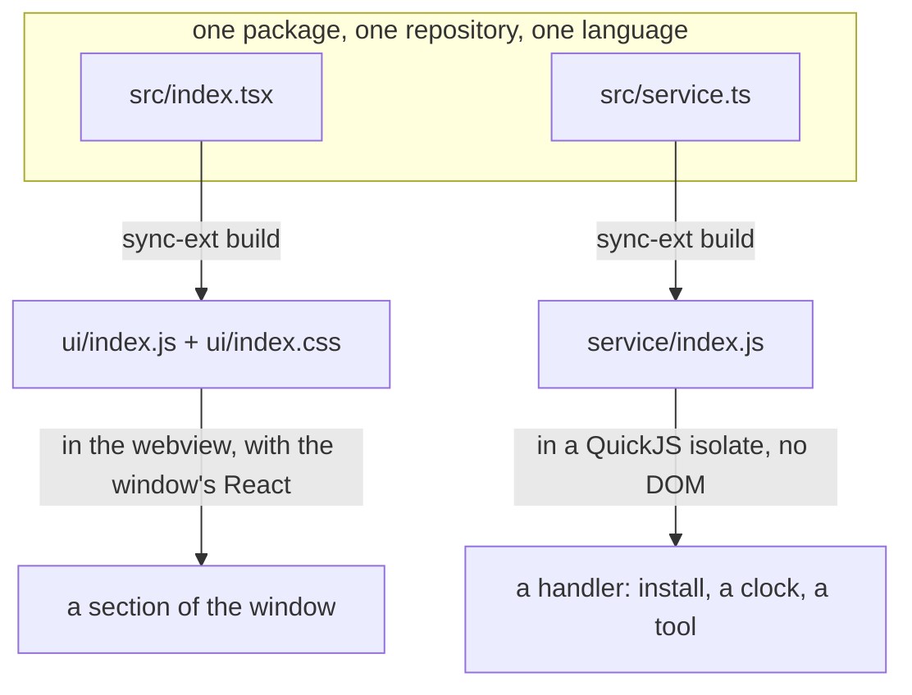

|  | `ui/index.js` | `service/index.js` |
| --- | --- | --- |
| Runtime | The webview, one React with the window | QuickJS embedded in Sync |
| Entry point | `export default function activate(host)` | `export default function register()` |
| Answers with | One `AreaModule` per declared area | A table of handlers by name |
| Lives for | As long as the window | Milliseconds |
| May draw | Yes | No |
| May reach the network | `host.net.fetch` | `net.fetch` |
| May reach the keychain | `host.vault` | `vault` |
| May order an agent | No | `work.order` |
| Needs | Nothing beyond the area | `background`, and one capability per occasion |

**Either, both, or neither.** An extension with no screen is the ordinary case
for a package that publishes a vocabulary and a prompt: its whole contribution
reaches a project without a line of it being executed. A default here would mean
shipping an empty module whose only reader is the packer.

**A handler is not work.** It runs for milliseconds and answers. What it may do
is *order* work that runs for hours, and the host performs that — a handler that
tried to do the work itself would be killed by its own five-second clock.

---

## 4. Anatomy of an archive

```
somepackage.syncext            a zip, registered as a document type
├── manifest.json              everything the host reads before running anything
├── types/*.json               one type definition per file
├── ui/index.js                the built ESM bundle; React and the surface external
├── ui/index.css               the rules its own markup uses, compiled from its own source
├── service/index.js           the handlers
├── prompt/instructions.md     served to agents as the topic extension:<id>
└── META/
    ├── hashes.json            path -> sha256, for every file above
    └── signature              minisign over the canonical hashes file
```

Every file outside `META/` is covered by `hashes.json`, and an archive carrying
a file the hashes do not cover is refused as firmly as one whose hashes
disagree. The signature covers **id and version** as well as contents, so a
signed package cannot be republished under another identifier.

### 4.1 The manifest, field by field

Unknown fields are refused rather than ignored: the file is generated by a tool,
so a member nobody recognises is a typo, and a typo dropped in silence becomes a
section that never appears.

| Field | Shape | What it decides | Refused when |
| --- | --- | --- | --- |
| `manifestVersion` | `1` | Which reader this file was written for | Any other number |
| `id` | string | The namespace for everything else: kinds, keychain entries, area keys, published tool names | Absent |
| `version` | semver | What the project's declaration pins and what an update compares against | Not a version |
| `name`, `summary`, `description` | string | Every word on the card. The shell writes none of them | `name` absent |
| `icon` | a `lucide-react` name | The mark on the row and the card | Never — an unknown name draws the neutral mark and says nothing |
| `engines.syncApi` | semver range | Which builds may load it | Unreadable, or this build is outside it |
| `capabilities` | string list | What a person agrees to, before anything runs | A name this build has never heard of |
| `net.hosts` | exact hosts | Where it may reach. One host each: no scheme, no port, no path, **no wildcard** | `net` without hosts, or hosts without `net` |
| `net.secrets` | `{host, header, secret, scheme?}` | Which of its own secrets Rust puts in which header | A host it does not reach; two secrets in one header at one host; a transport header |
| `types` | paths | The vocabulary published into the project's memory | A kind not prefixed with the id |
| `opens.kinds` | its own kinds | Which kinds the shell may hand it to display | A kind belonging to somebody else |
| `opens.projectTypes` | boolean | Whether it opens the types a project invented for itself | — |
| `areas[]` | `{id, label, description?, frame, icon?, badge?}` | The sections, and the shape of each | A frame outside `browse`, `list`, `detail`, `single` |
| `areas[].badge` | `{kinds?, freshness?}` | What the host counts on that row with no code running | A freshness state the contract does not publish (held by `sync-ext check`) |
| `ui` | path | The module | Declared with no file, or an area declared with no `ui` |
| `styles` | path | The stylesheet, added to the document **before** the module is fetched | — |
| `service` | path | The handlers | Present without `background` |
| `lifecycle.installed` | handler name | Called once, synchronously, while a person waits | Names a handler the module does not return |
| `schedule[]` | `{handler, every, description}` | The clock: an interval, a floor of one minute | Present without `schedule`; `description` absent |
| `tools[]` | `{handler, name, description, input?}` | What an agent is told it may call | Present without `agent.tools`; a name with a dot; a name this build already uses |
| `prompt` | path | What a connected agent reads, as `extension:<id>` | — |
| `requires.extensions` | `id@range` | A statement, **not a gate** — this build does not enforce it | — |
| `dependencies.npm` | package names | That something is fetched before it works | — |
| `author`, `license`, `repository` | | The card's provenance | — |

**`handler` and `name` are two names for two readers.** The handler is the
package's own name for one of its functions; the name is what is published with
the package's id in front of it. That is why a tool name may not carry a dot —
it is where a published name splits.

### 4.2 What a manifest may not do

- Name another extension's kind, in `types`, in `opens.kinds` or in `badge.kinds`.
- Declare a design token — `--surface-*`, `--spacing`, `--radius-*`. A package
  that set one would not be styling its section, it would be repainting every
  column, sheet and menu in the window.
- Widen its own limits. Timeouts, sizes, the memory ceiling and the redirect
  policy are the host's, because an extension that could raise its own has none.
- Ask for a wildcard host. `*.example.com` is a family nobody enumerated, and it
  is the shape every allow-list is eventually widened by.

---

## 5. A published type is the public interface

This is the main channel a package has, and most cooperation needs nothing else.

```json
{
  "kind": "release-radar.release",
  "title": "Release",
  "description": "A version somebody published of something this project depends on",
  "icon": "package",
  "fields": {
    "repository": { "type": "string", "required": true },
    "version":    { "type": "string", "required": true },
    "published":  { "type": "string", "description": "ISO 8601, as the API gave it" },
    "breaking":   { "type": "boolean", "default": false }
  },
  "relationships": {
    "watches": { "target": "release-radar.watch", "description": "What was being watched" }
  },
  "guidance": "Write one record per published version. The title is the tag."
}
```

`fields` and `relationships` are carried to the engine untouched — there is one
spelling of a type definition between the file an author writes and the
transaction that publishes it, because a second spelling in between is how a
definition ends up depending on which of two writers produced it.

| Member | Values |
| --- | --- |
| `type` | `string`, `text`, `enum`, `number`, `integer`, `boolean`, `array`, `object` |
| `required` | boolean |
| `values` | what an `enum` allows |
| `items` | one declaration, for what an `array` holds |
| `default` | what a control offers when somebody fills it in |
| `description` | what the field means |

**The trap: a record already has an envelope.** `key`, `kind`, `title`,
`content`, `tags`, `links`, `scope`, `observed`, `archived` and `folder` belong
to every record whatever its type. A type that declares one of those as a
product field has declared a field nothing can write, and the collision is
silent until somebody tries. Name it something else — `heading` rather than
`title`, `area` rather than `folder`.

**Reading is open, writing is fenced by the type rather than by the manifest.**
Any extension reads any record of any kind in the project it is running in. The
engine validates a write against the type definition, not against who is
writing, so writing into another package's vocabulary is possible and is real
coupling — the shape can change under you. Publish a type of your own and
**link** to theirs instead: a relationship names a record without claiming to
own its shape.

---

## 6. Lifecycles, as sequences

### 6.1 Installing

```mermaid
sequenceDiagram
    participant P as A person
    participant W as The window
    participant R as Rust · sync-extensions
    participant D as The disk
    participant E as The engine

    P->>W: chooses a card, or drops a .syncext, or picks a folder
    W->>R: download / read
    R->>R: hashes.json against every file
    R->>R: signature (read and shown; not yet a gate)
    R->>R: engines.syncApi and every capability
    R->>D: unpack into artefacts, one directory named after the sha256
    R->>R: read types/*.json and the prompt out of the artefact
    R-->>W: the manifest, its types, its prompt
    W->>E: publish the types — one transaction
    W->>E: write installed[] into the project record
    Note over W,E: types first, declaration second.<br/>A failure between them leaves types nobody declared,<br/>which the next install reuses.
```

Three properties of this order are load-bearing:

- **Verification is before unpacking.** An archive with one line appended and
  its hashes untouched leaves the artefact directory with exactly one entry,
  named after the honest archive.
- **Types are read in Rust, not fetched by the window.** A file inside an
  artefact is reachable over `syncext://` and nothing else, and fetching one
  would widen the webview's `connect-src`. It also has to work for a package
  with no code at all.
- **Removing writes only the declaration.** Types and records stay exactly where
  they are, and the confirmation says how many records will be left with nothing
  to show them.

### 6.2 Activating an area

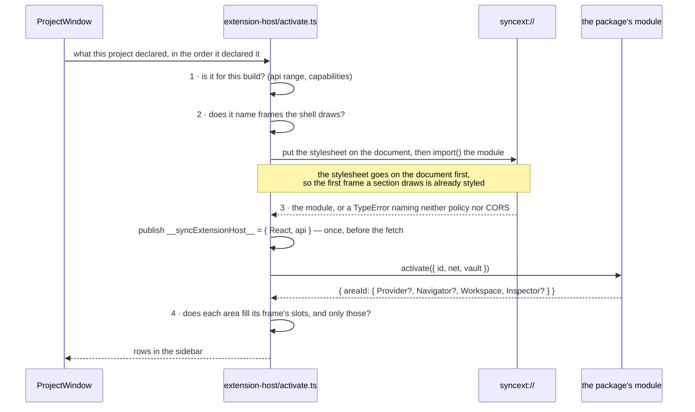

**Why the runtime is on the global rather than an argument.** An author writes
`import { useState } from "react"`, and that import is resolved while the module
is being evaluated — before anything has been called. There is no way to hand
something to a module during its own evaluation, so the objects have to be
somewhere it can look. What `activate` receives is what the module could not
have known: its own id, and the two doors built for it.

**One activation per `id@version#url`.** Calling `activate` twice returns
different component objects, React sees a different type, and the whole area is
rebuilt — losing exactly the state the mounting rules exist to keep.

**Mounting rules.** An area is mounted on first visit, frozen when another is
selected, and never unmounted. So no extension implements state restoration, a
frozen area stops reading the store — and keeps reporting its badge, which is
the one channel a frozen area keeps.

### 6.3 A clock tick

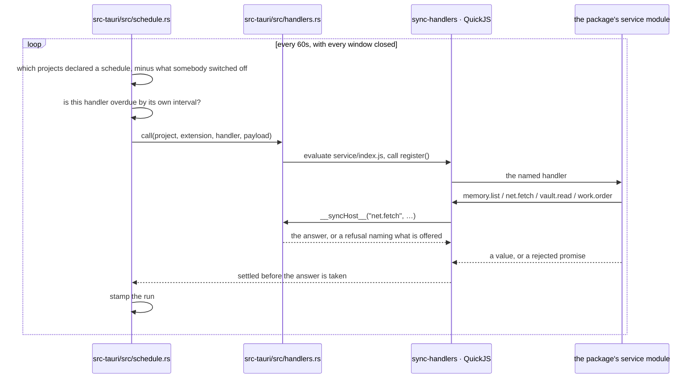

**The promise is an interval and nothing more.** Lateness is not made up for,
drift is not corrected, and a machine asleep for six hours runs a handler once
when it wakes rather than six times. A syntax that could express *the first
Monday of a quarter* is a syntax somebody will express it in, on a machine that
was asleep — so `every` is `15m`, `1h`, `24h`, with a floor of one minute.

**A person can stop it per project** from the extension's own page, without
removing the package. What is stored is the ids that were switched *off*: a list
of what is on would be a second consent, and a project would stop ticking the
day something failed to write a `true` nobody asked for.

### 6.4 An agent calling a tool

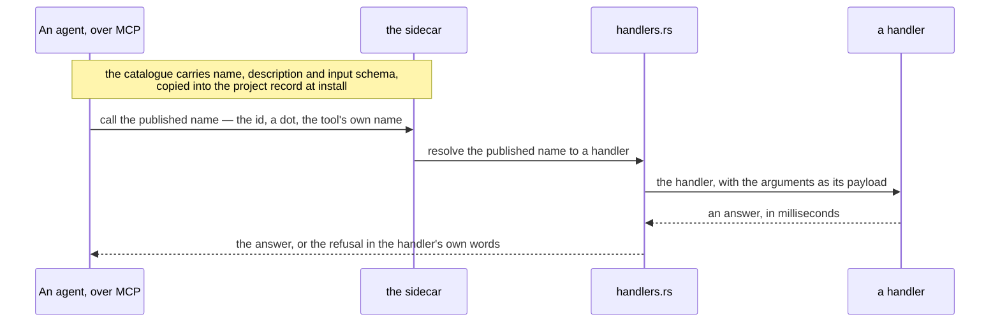

**This is the one occasion whose caller is not the application**, which is why
everything a caller needs in order to decide to call it is in the manifest
entry: the name, the sentence the decision is made on, and the schema the
arguments are checked against. None of it is the host's to write, because the
host knows none of it.

`input` is a JSON Schema carried whole and never interpreted — what an argument
means is the package's business — and an absent one is a tool that takes
nothing.

### 6.5 A request leaving the machine

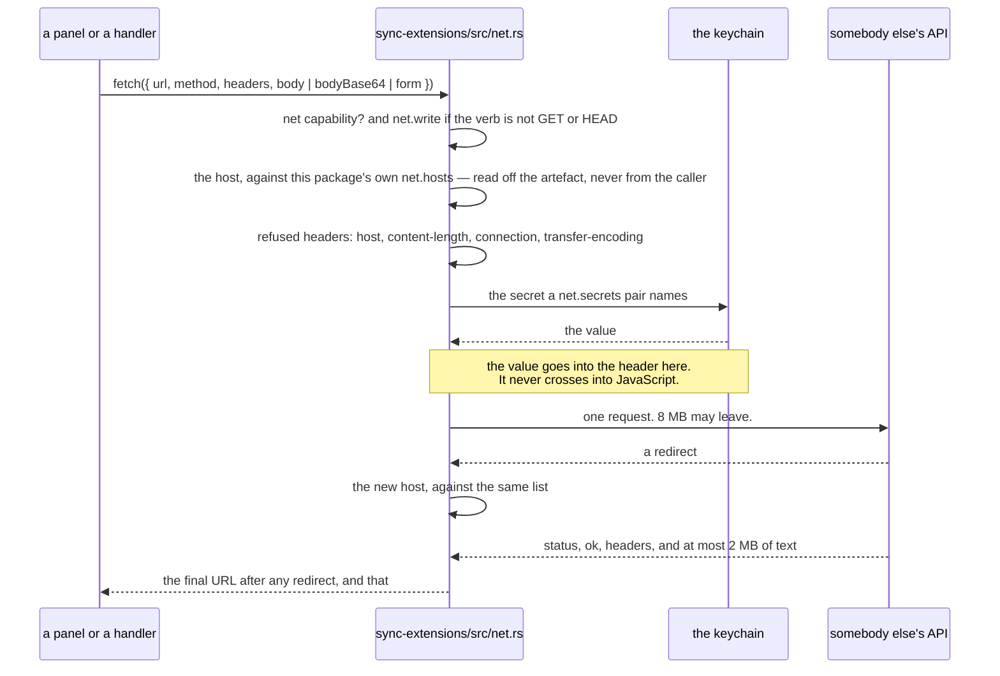

**Nothing is retried.** A request that timed out may have been performed, and
whether to send it again is a question only the package can answer.

**One request sends one thing and says which of the three it is.** `body` is
text, `bodyBase64` is bytes, `form` is `multipart/form-data`; two of them
together is a refusal rather than a choice made on the package's behalf.

**`net.write` is an agreement, not a boundary**, and the difference belongs
here rather than in somebody's head: a package that reaches a host at all can
put whatever it likes in a query string, and can cause an effect with a `GET`
wherever the other end is built that way. What it buys is the sentence a person
reads before installing — *this one acts, that one watches* — and a refusal for
an honest mistake.

### 6.6 Updating

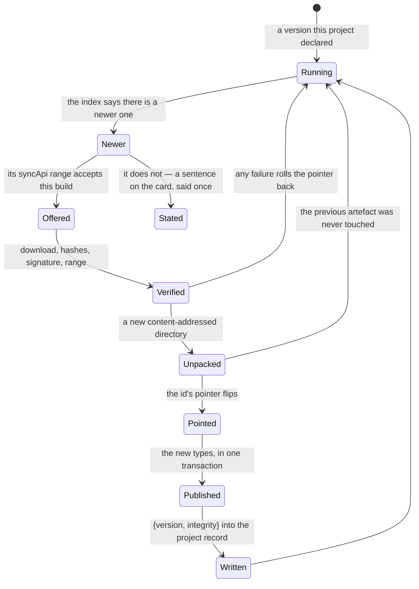

**Nothing updates itself.** Installing publishes type definitions into the
project's memory, which is a write to the repository — doing that while somebody
is not looking is not an update, it is a commit they did not make. What the
window does instead is say so: a mark on the pinned row, and a line on the card.

**Nothing polls.** The index is read when the catalogue is opened, with its
ETag, so a second look usually costs a 304. The mark on the pinned row is drawn
from whatever the last fetch left on the disk — a machine that has never opened
the catalogue says nothing about updates, which is the honest state of it.

**A folder is never offered one.** It is read where it lies and its files are
whoever is writing them.

---

## 7. The states a package can be in on this machine

Every one of these is reachable in ordinary use, and the card has to be able to
say each of them.

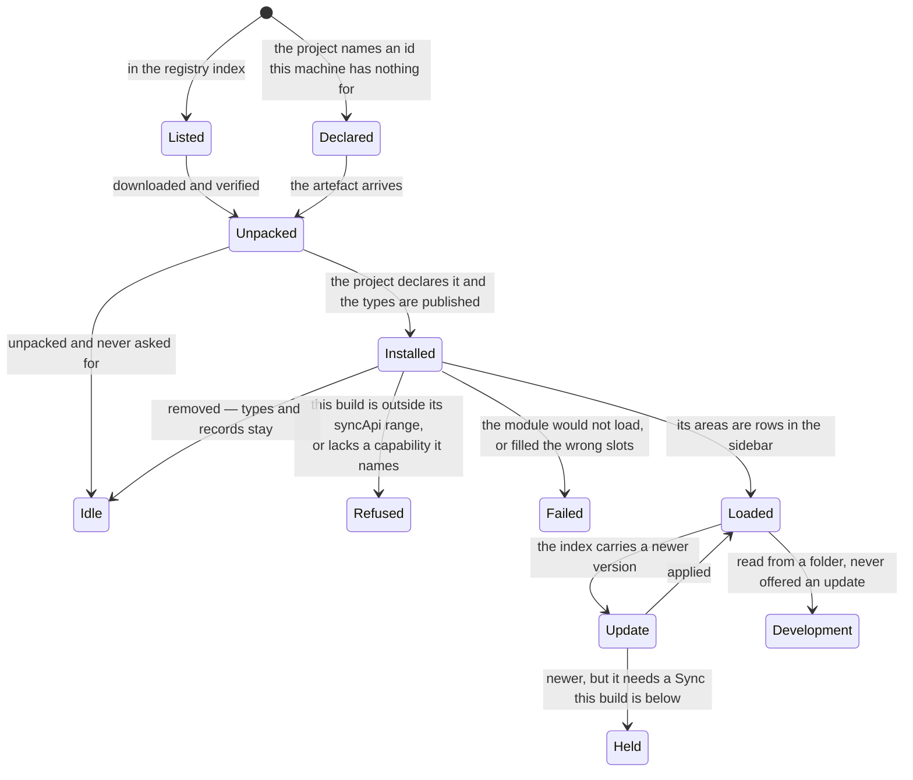

`Idle` is not a failure and is deliberately listed: a package on somebody's disk
is taking up room whether or not this build can run it, and a catalogue that hid
it would hide the thing they came to remove.

---

## 8. Capabilities

Semver answers *is this surface compatible*. It cannot answer *can this build do
the thing* — a platform with no bundled ACP sidecar publishes the same
`useAgentSession` type and cannot raise an agent behind it.

| Capability | What a person agrees to | Checked | Pairs with |
| --- | --- | --- | --- |
| `records` | The corpus: types, records, freshness, the editor, the metadata panel | manifest | |
| `agents.acp` | Agents driven over ACP, as processes on this machine, and where each conversation works | manifest | §8b |
| `markdown.plugins` | Replacing how one block of stored prose is drawn | manifest | |
| `native-menu` | Secondary click opens a system menu rather than a drawn one | manifest | |
| `folders` | The repository's own folders, as a hierarchy records are filed in | manifest | |
| `sheets` | The window-level sheets: a type, a removal, a folder | manifest | |
| `net` | Reading something outside this window, from the hosts it names | manifest | requires `net.hosts` |
| `net.write` | Changing something where it reaches, rather than reading it | **call** | requires `net` |
| `vault` | Its own corner of the system keychain | **call** | §8a |
| `background` | It runs code with no screen mounted | manifest | required by `service` |
| `schedule` | It runs while nobody is there | manifest | required by `schedule[]` |
| `work.agent` | It may raise an agent, which **spends money while they sleep** | **call** | scanned by `sync-ext check` |
| `agent.tools` | An agent is told it is there, and may act through it | manifest | required by `tools[]` |

**A capability this build has never heard of is refused rather than ignored.**
It arrives in exactly one situation — a package built against a newer host — and
treating it as satisfied would run an extension that asked for something and did
not get it, which fails later and somewhere else.

**Four of them are about code with no screen, and they are four agreements
because they are four different questions.** `background` is this package
running its own code; `schedule` is running it unattended; `work.agent` is
spending somebody's tokens while they sleep; `agent.tools` is an agent being
told the package is there and acting through it. A person shown only the first
has agreed to something considerably narrower.

**The one rule no check can hold.** A secret is never handed to an agent — not
in the prompt of an order, not in the environment a process is raised with, not
as a tool that answers with one. What an agent is given is a method that *does
the work*: sign this request, fetch this page, post this comment. Sync does not
check it, because a value that has crossed into a package's JavaScript is that
package's to pass on and the call that would pass it on is invisible to anything
reading a manifest. What an agent does with a token is worse than a leak: a
transcript is kept, read back and sent to a model again, so a token that reaches
one has been published rather than mislaid.

§8a is the mechanism under all of that: where a secret is kept, how its address
is composed, and the road that lets a package use one without ever holding it.

---

## 8a. The vault, end to end

A secret is in none of the stores §9 lists. It is in the system's own secure
storage, and everything below follows from why.

**Not the project's memory**, because that memory travels on a Git remote:
ciphertext that has left this machine cannot be called back, and a token that
has been revoked has to be gone. **Not the webview's storage**, because that is
a file every process running as this person can read. So: the system keychain,
one crate that opens it, one module that decides who may ask.

### The address, and why a caller can only supply half of it

```
service:  "Sync"                 one string for the whole application
item:     "<owner>/<name>"       the package, then whatever it calls its own secret
                ^
                the separator. The owner may not contain it; the name may.
```

**The two halves come from two different places and are joined in Rust.** The
owner is the id resolved against what is installed on this machine; the name is
whatever the call said. There is no way to construct an address that names a
service, so a caller cannot reach outside Sync's own entries at all — and no
name can reach out of its own namespace:

| A package writes | The entry it addresses |
| --- | --- |
| `token` | `a-package/token` |
| `staging/token` | `a-package/staging/token` — two names of its own |
| `another-package/token` | `a-package/another-package/token` |
| `../another-package/token` | `a-package/../another-package/token` |
| `/token` | `a-package//token` |

The asymmetry is what makes reading the name backwards unambiguous: the owner is
everything before the *first* separator, so a package putting slashes in its own
half gets more names rather than a way into somebody else's. A package that
wants a different secret per project puts the project in its own half — that is
its decision to make, and nothing here makes it for it.

### Three callers, one door, one crate

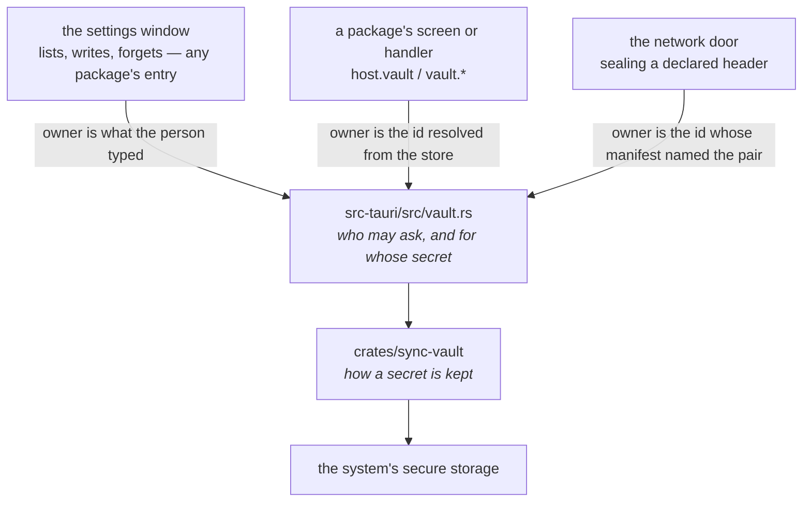

| Caller | May | Gets a value | Capability |
| --- | --- | --- | --- |
| The settings window | list, write, forget | **no** | — |
| A package's screen | read, write, forget — its own namespace | yes | `vault`, checked at the call |
| A handler | the same three | yes | `vault`, checked at the call |
| The network door, sealing a header | read, one entry the manifest named | the value never leaves Rust | **none, deliberately** |

**The settings window has no read, and that absence is the design.** The window
never shows a secret, so a command that handed one to it would exist only to be
misused. It writes an owner the person typed and does not check it against what
is installed: somebody may quite reasonably store a token before installing the
package that will read it, and refusing at that moment would be the window
inventing a rule nobody asked for.

**The sealed-header path asks for no capability on purpose.** It is the road
that exists so an author who only has to reach an API with a token never holds
one, and pricing the safe road at the same rate as the other would be an
argument for taking the other. What it costs instead is a declaration a person
reads on the card before installing: which secret, to which host, in which
header, and that the package does not read it.

### The two ways to use one, and what each costs

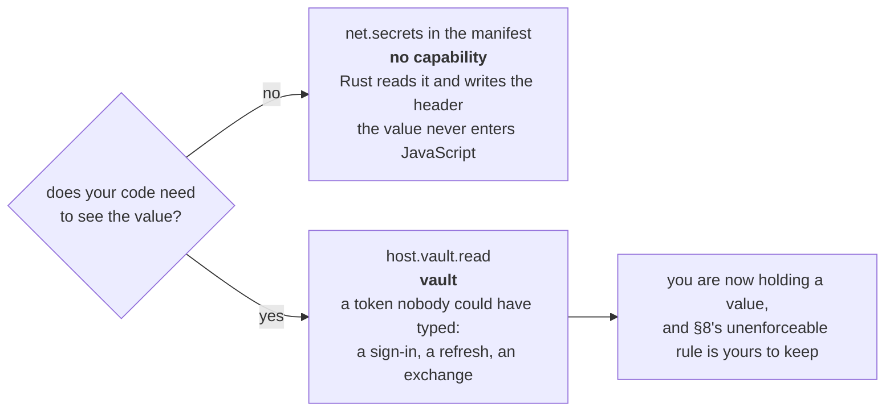

`{ host, header, secret, scheme? }` is the declaration, and four things about it
are refused when the manifest is read rather than met as a request behaving
oddly: a host the package does not otherwise reach; an empty header or an empty
secret name; one of the four headers the transport writes for itself; and two
secrets sent to one host in one header, which is one header meaning two things.

`scheme` is written in front of the value with a space — `Bearer <value>` — and
no scheme sends the value alone, which is what an API-key header wants.

**An entry that is not there is a refusal in words, never a request sent without
the header.** The manifest promised the header would be there, and a silent
`401` from somebody else's API is an hour of the wrong person's time.

### Waiting is not refusing

Every call into the store has a deadline of **twenty seconds** — the same number
the network door holds a column for.

The system may put a dialog up and ask a person for permission. A dialog with
nobody in front of it is a process that waits for ever rather than a call that
fails, and a handler woken by the clock at three in the morning needs the
second. So the crate answers *the keychain is asking somebody for permission and
nobody answered* — which a caller can report — rather than hanging, and that
answer is a different one from *the person said no*.

**A build from source asks every time, and the packaged application does not.**
macOS decides who may read an item from the signature on the program asking, and
the boundary is the signing team rather than one binary. `cargo run`,
`tauri dev` and a sidecar built from source carry no signature at all, so the
system asks. That is a property of an unsigned build rather than a defect, and
it is the thing here most likely to be mistaken for one.

### Two smaller mechanisms worth knowing

**A value a handler read does not reach the log.** `console` goes somewhere that
outlives the window, the afternoon and usually the debugging, and an author who
prints a token while working out why an API said no is forgetting rather than
abusing anything. The host knows every value it handed over — it writes a
`vault.write` down *before* the call, because a write that failed still had the
value pass through — and takes them back out of what it prints, saying where one
was. A mechanism rather than a rule, because a rule here would be advice nobody
is reading at the moment it matters.

**The store is asked how long it holds things.** *Until deleted*, *until
logout*, *until reboot*, *while something is running*, or *it did not say*. Both
are correct implementations of the same trait, and the difference is the whole
of what somebody needs to know before typing a token into one — so it is asked
rather than assumed, and the settings window says it.

**Nothing is kept beside the store.** What Sync is holding is answered by
searching it under that one service; a file listing the names would be a second
answer to the same question, going wrong the first time somebody deletes an
entry in Keychain Access — which they are entitled to do, and which shows up
here as the entry simply being gone. The service is stated in the search *and*
asked for again on the way back: a store whose matching is looser would
otherwise decide what Sync lists, and a search without the service matches every
generic password the person has — 126 of them on the machine this was measured
on, most of them their own.

### What can go wrong

| What you see | What it is |
| --- | --- |
| *did not ask for the "vault" capability* | The manifest. It is checked at the call, because whether a package touches a secret at all is inside its JavaScript |
| *there is no secret stored under that name* | Nothing was written, or somebody deleted it in Keychain Access |
| *nobody answered within 20 seconds* | The system asked a question and there was nobody there. Not a refusal — an unanswered one |
| A password dialog on every launch | An unsigned build. Not a defect in this code |
| *this build has nowhere to keep a secret* | The platform has no store this build was compiled with |
| A request refused before it left, naming a secret | A `net.secrets` pair whose entry is not in the keychain |
| Two packages reading each other's entries | Cannot happen from a call: the owner half is never an argument. Every extension in a window shares one origin, so what holds two packages apart is the door each was handed |

### Deliberately absent

- **Export, and any route between machines.** A secret is put in again on the
  second Mac, because a copy of one is a copy that cannot be revoked.
- **A second store to choose from**, and a per-entry list of trusted programs.
  The signature already draws the line those would draw.
- **A read for the settings window.** Above.
- **Any check on what a package does with a value it holds.** §8, and it is
  stated rather than pretended.

---

## 8b. Where a conversation works

A conversation is held in the project's own working tree unless the package
opening it says otherwise. `startSession` takes a `worktree`: `"new"` makes one,
or a tree that already exists is named by its path. The tree is made before the
agent is raised, so a tree that cannot be made is a conversation that never
opens rather than one that quietly opened somewhere else.

**The tree is detached and carries no branch.** Nothing is added to the
repository while the work is being done, because branch naming is a convention
of whoever owns the repository. `adoptWorktree` is where a name is asked for and
a branch is created; `discardWorktree` removes the tree, and the commits in it
go too. A row says which tree it is in — `SessionRow.worktree` — and that is
what both gestures are addressed by.

Two things a package cannot do, and both are the same rule. It cannot name a
directory that is not one of this project's trees: paths are checked against
git's own list, so where trees live stays the installation's choice. And it
cannot move a running conversation to another tree: the directory reached the
agent in `session/new` and it has read files from there.

What this buys is reversibility, not safety. An agent in a tree has a shell like
any other, and §9 of `docs/background.md` promises no sandbox.

---

## 9. Where each fact lives

| Fact | Where | Travels with the repository | Why there |
| --- | --- | --- | --- |
| The archive's files | `artefacts/<sha256>/` in the app data directory | no | Content-addressed, so it is shared by every project and re-installing is free |
| Which extensions a project runs, at which version, with which hash | The project's `installed[]` record, in its memory | **yes** | It is the project's decision, and the same folder opened elsewhere resolves the same versions |
| A type definition, and every record of it | The corpus, on `refs/memory/main` | **yes** | It is what the project knows, and removing an extension deliberately leaves it |
| What a package tells an agent, and the tools it offers | Beside the declaration, rewritten from the package when they disagree | **yes** | Read by something that cannot see the catalogue |
| A package's secrets | The system keychain, under one service, the owner half composed in Rust | no | It has to be able to disappear; a copy on a Git remote cannot be called back |
| Which clocks somebody switched off | A file in the app config directory, by project | no | The clock reads it with every window closed |
| Where working trees are made | A file in the app config directory | no | Which disk has room is a fact about a machine, and a path in a repository would be wrong on the next one that cloned it |
| What a working tree was made from | A note in that tree's own administrative directory | no | Git removes the directory with the tree, so the note lives exactly as long as what it describes |
| The last time each handler ran | Beside that file | no | It is this machine's history, not the project's |
| Which area is selected, and every panel width | React state | no | It is this run of the window's |

---

## 10. The nine places an extension may appear

The set is closed, and the closing is the point: a window whose shape is decided
by whatever is installed has as many shapes as it has extensions, and no rule
left to enforce against the next one.

```
┌──────────────────────────────────────────────────────────────────────┐
│  title bar — the project's, and ⌘K over the whole corpus             │
├───────────────┬──────────────────────────────────┬───────────────────┤
│ sidebar       │ navigator │ workspace │ inspector│                   │
│               │           │           │          │                   │
│ ▸ a section ①│    ③ the frame an area declared, and the slots it   │
│   with a ② 3 │       fills — never columns of its own              │
│ ▸ another     │           │           │          │                   │
│               │           │           │          │                   │
│ ─────────────│           │           │          │                   │
│ ⚙ Extensions  │           │           │          │                   │
└───────────────┴──────────────────────────────────┴───────────────────┘
     ① Area          ② Badge          ③ what the module returned
```

| Point | What it is | Runs code? |
| --- | --- | --- |
| **Area** | A section in the sidebar, in one of four frames | on first visit |
| **Badge** | A count or a dot on that row, declared in the manifest or reported live | declared: no |
| **Types** | A vocabulary published into the project's memory | no |
| **Prompt** | What a connected agent is told, as `extension:<id>` | no |
| **Opener** | Which kinds it can show, and whether it shows the project's own types | no |
| **Menu commands** | What File offers while its area is selected | yes |
| **Markdown plugin** | Replacing how one block of stored prose is drawn | yes |
| **Native menu** | Secondary click, through the host's own menu | yes |
| **Handler** | A function called with no screen mounted: at install, on a clock, by a tool's published name | yes, without a window |

**A figure and a dot are two claims, and never each other.** A figure is how
many there are, and is as true when nobody is looking; a dot is *something
happened, go and look*. A mark that is permanently on is not news, so a large
figure is abbreviated rather than replaced by a dot.

**The badge belongs to the area, not to the extension.** An extension with no
area has nowhere to put a mark — and that is a rule rather than an accident,
because a notification with no place to land would have to become a system
alert, which is a much louder thing than anybody asked for.

**Not open, each for its own reason.** The record inspector, because it is drawn
by whichever extension shows records — contributing to it would be a protocol
between extensions rather than a host API. Geometry, because `shell-layout.ts`
is the window's. The shell's own screens. The Dock and the menu bar, because
they belong to the application rather than to a project. A page of the settings
window, an entry in ⌘K, and a system notification — a banner is the badge said
louder, and an extension that could send one is an extension that could shout.

---

## 11. Two extensions, cooperating, having never named each other

**No extension can call another.** There is no message bus, no directory of ids
to dial. A package that addresses another by id breaks the day a better
implementation of the same thing arrives; everything below addresses a *kind of
thing* instead, which survives that day.

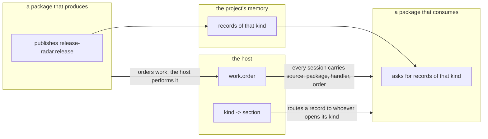

| Channel | What it survives | What it costs |
| --- | --- | --- |
| **A published type** | Quitting, cloning, a colleague opening the project | The shape is a promise you now keep |
| **Routing by kind** | A better implementation replacing the producer | You may not register as the destination for somebody else's kind |
| **The host performing work** | The other package not being installed at all | Nothing — neither package is named |

**Degrade rather than require.** A consumer whose producer is not installed
finds no records of that kind, which is an ordinary empty list. Refusing to run
would turn a soft absence into a hard failure. `requires.extensions` exists for
the case where a package genuinely depends on a particular other one, and it is
a statement rather than a gate.

---

## 12. Refusals, and where each one is heard

| What you see | What it is | Where it comes from |
| --- | --- | --- |
| The card says *needs a newer Sync* | `engines.syncApi` excludes `SYNC_API_VERSION` | `extension-api/version.ts` |
| The card names a capability | The manifest asks for something this build does not publish | `refuseIncompatible` |
| A `TypeError` naming neither the policy nor the scheme | CORS. The module was fetched cross-origin and the response carried no `Access-Control-Allow-Origin` for this window's origin | The `syncext://` handler in `src-tauri/src/extensions.rs` |
| The section is there and unstyled | The stylesheet was not compiled from the package's own source, so utilities the shell does not happen to use produced no rule at all | `sync-ext build`, and the `styles` field |
| An empty column | An area returned a slot its frame does not have, or did not return one it does | `extension-host/activate.ts` |
| The row draws a neutral mark | An icon name the shared library does not have. It fails silently by design | `kindIcon` |
| A section that never appears | An area renamed in the manifest and not in the module, or the other way round | `sync-ext check`, which runs the module against a stand-in host |
| *This build cannot do that* at a call | `net.write` for a verb that is not `GET` or `HEAD`, `vault` without the capability, or `work.order` without `work.agent` | Rust, at the call |
| A request refused before it leaves | A host the manifest does not name, on the first request or on any redirect after it | `sync-extensions/src/net.rs` |
| A handler that fails at five seconds | The wall clock. It is not configurable, because an extension that could raise its own ceiling has none | `sync-handlers` |
| A conversation that will not open in a tree | The folder is not a repository, has no commit yet, or the path named is not one of this project's trees | `src-tauri/src/worktree.rs`, at the call |
| A field written and read back as absent | The window and the engine agree on a shape, and an unknown member is dropped without an error | Write it, read it back, and cover it with a test that does both |
| A field that will not write at all | A product field named after an envelope member — `title`, `folder`, `tags` | §5 |

---

## 13. The invariants

The list a reader edits this system against. Breaking one of the first three is
a red build; the rest are held in review.

1. **No extension lives in this repository.** No `src/extensions/`, and nothing
   resolves a path into one.
2. **`sync-memory` is the only door to the engine.** Nothing else opens
   `refs/memory/*`, touches the index, or loads a model.
3. **The surface is versioned and the number moves with it.** `pnpm api:check`
   fails both when the surface moved and the report did not, and when the report
   moved and `SYNC_API_VERSION` did not.
4. **The core cannot name an extension** — not in a constant, not in a type, not
   in a conditional. What survives that rule is a lookup over data.
5. **An extension sees the application through one module and nothing else.**
   `src/lib/extension-api/index.ts` is the whole surface; an import past it does
   not resolve, because the code is built in another repository.
6. **One copy of anything with identity; its own copy of anything that is a pure
   rule.** React because of the dispatcher, the component library because of
   portals and focus traps, the tokens because they are the design — one copy.
   An icon, a utility class — its own.
7. **A package carries rules and no values.** Every token name resolves to a
   `var()` the window defines, so retinting the window retints every extension
   in it with nothing rebuilt.
8. **Limits belong to the host.** Timeouts, sizes, memory, concurrency, redirect
   policy.
9. **Every occasion resolves through one answer to *which function is this*, and
   runs through one evaluation path.** An occasion added later cannot quietly
   get a different runtime, different limits or a different host.
10. **A refusal is a sentence.** Not silence, not a dropped member, not a
    default chosen on the package's behalf. What `fetch` has and this does not is
    refused by name rather than ignored, because a member dropped in silence is a
    timeout somebody believes they set.
11. **The set of extension points is closed**, and widening it is a decision
    about the window rather than a feature of a package.
12. **A capability is a promise a build can keep.** Publishing one this build
    cannot honour is a lie in the one place a person is deciding what to trust.

---

## 14. Which file answers which question

| Question | File |
| --- | --- |
| What may an extension see? | `src/lib/extension-api/index.ts` |
| What number is it promised under, and what may it ask for? | `src/lib/extension-api/version.ts` |
| What is the shape of the host's doors? | `src/lib/extension-api/contract.ts`, `net.ts`, `vault.ts` |
| What is the surface, exactly, as a machine reads it? | `api/extension-api.api.md` |
| How is a package run, and what are the four refusals? | `src/lib/extension-host/activate.ts` |
| How does a section become a row? | `src/lib/extension-host/areas.ts` |
| Where does the count on a row come from? | `src/lib/extension-host/badges.tsx` |
| What does the catalogue show, and where does each entry come from? | `src/lib/extension-host/catalogue.ts`, `marketplace.ts`, `updates.ts` |
| What may a manifest say? | `src-tauri/crates/sync-extensions/src/manifest.rs` |
| What is published into a project's memory? | `src-tauri/crates/sync-extensions/src/vocabulary.rs` |
| How is an archive verified and unpacked? | `src-tauri/crates/sync-extensions/src/archive.rs`, `store.rs` |
| How does a request leave the machine? | `src-tauri/crates/sync-extensions/src/net.rs` |
| What is the isolate, and what is in it? | `src-tauri/crates/sync-handlers/src/lib.rs` |
| Who may ask a handler for what? | `src-tauri/src/handlers.rs` |
| What ticks with no window open? | `src-tauri/src/schedule.rs` |
| Where is a conversation held, and what becomes of the tree? | `src-tauri/src/worktree.rs` |
| What serves `syncext://`? | `src-tauri/src/extensions.rs` |
| Who may ask the keychain, and for whose secret? | `src-tauri/src/vault.rs` |
| How is a secret kept, and how is its address composed? | `src-tauri/crates/sync-vault/src/lib.rs` |
| Which declared secret rides on which request? | `net.rs`, and `sealed_for` in `src-tauri/src/extensions.rs` |
| Which shapes may the window take? | `src/lib/shell-frames.ts` |
| Which section opens a record of this kind? | `src/components/shell/opening.ts` |

---

## 15. Deliberately absent

Named so they are not proposed again as small things.

- **A wasm runtime.** Rejected rather than deferred. The extensions that exist
  are TypeScript, and a wasm runtime would make their authors learn a second
  language to poll an API. Measured: QuickJS adds 528 KB to a release binary
  synchronously and 643 KB with async, against 4.03 MB for a minimal wasmtime.
- **Extension to extension.** No bus, no directory, no `accepts` in a manifest.
  §11 is what replaces it.
- **A package emitting an intent.** The shell produces requests and a section
  receives one; a package cannot yet say *take the person to whoever shows this*.
  When it can, it will be one function over the resolution in §11.
- **Writing to the corpus from a handler.** A handler reads. Writing arrives
  with the capability that gates it.
- **Signature as a gate.** The format carries one, verification is written, and
  the state is drawn on the card. What is missing is the key, so a signature is
  reported rather than enforced. Every other check refuses outright.
- **A sandboxed tier for unsigned UI.** The signature format is what lets that
  arrive without a redesign.
- **Paid extensions, ratings, anything that makes the registry a storefront**
  rather than an index.
- **A vocabulary of permitted CSS utilities.** A list of what we thought of in
  advance is a wall in front of exactly the author who needed something we did
  not.
- **A response body that is not text.** A package can send a picture and cannot
  read one back: sending is what a package writing into somebody else's tracker
  needs, and nothing installed here has yet needed the other direction.
