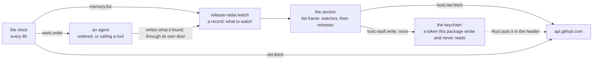

# Writing an extension

One package, built from nothing, with every file it contains. It is a real
shape rather than a toy: it publishes a vocabulary, draws a section, reaches an
API it named, keeps a token it never reads back, runs on a clock with the window
closed, and answers a tool an agent calls.

[`extension-architecture.md`](extension-architecture.md) is the map — the
boundaries, the manifest field by field, each lifecycle as a sequence.
[`extensions.md`](extensions.md) is the reasoning behind both. This is the
walkthrough, and it assumes neither.

---

## 0. What you need, and the loop you will work in

The contract is published as `@sync-buzz/extension-api`. It carries the types
you compile against, the manifest's JSON Schema, `SYNC_API_VERSION`, the
capability names, and a CLI:

```
sync-ext build     compile src/index.tsx and src/service.ts into what the manifest names
sync-ext dev       the same, in watch mode
sync-ext check     the manifest schema, kind prefixes, the API range, forbidden imports,
                   and the module run against a stand-in host
sync-ext pack      the reproducible .syncext, signed when given a key
```

**The loop is a folder.** Sync installs an extension from a directory, reads it
where it lies, and reloads it without restarting the window. So the loop is
edit, build, reload, look — and the card says *Development*, because the one
thing worse than no sandbox is a sandbox somebody forgot they had opened.

**Nothing you write is compiled into Sync.** Your package is built in your own
repository against the published contract; there is no Sync source to reach
into, and an import that goes past the contract does not resolve.

---

## 1. What we are building

**Release radar.** A project depends on things other people publish. This
package keeps a list of what to watch, shows what has been released against
each one, orders an agent to write up anything that looks like it matters, and
lets an agent ask what is new without a window being open.



Seven of the thirteen capabilities, and one deliberate refusal: it asks for
`net` and **not** `net.write`, so the card says it watches rather than acts.

**One thing this shape is working around, and it is worth knowing before you
read the code.** A handler cannot write to the corpus in this build — it reads.
That is why the clock does not write a record when it finds a new release: it
orders an agent, and the agent writes through its own door. A package that
wanted to write mechanically writes from its screen, where `useCorpus` is.

```
release-radar/
├── package.json
├── manifest.json
├── types/
│   ├── watch.json
│   └── release.json
├── src/
│   ├── index.tsx          the section
│   ├── service.ts         the handlers
│   └── styles.css         the rules its own markup uses
└── prompt/
    └── instructions.md    what an agent is told
```

---

## 2. The manifest

Everything the host reads before running a line of your code. Unknown fields are
refused rather than ignored — the file is generated by a tool, so a member
nobody recognises is a typo, and a typo dropped in silence becomes a section
that never appears.

```json
{
  "manifestVersion": 1,
  "id": "release-radar",
  "version": "1.0.0",
  "name": "Release radar",
  "icon": "radar",
  "summary": "What has been released of the things this project depends on",
  "description": "Keeps a list of repositories to watch, shows what has been released against each, and asks an agent to write up anything that looks like it matters.",

  "engines": { "syncApi": "^3.3" },
  "capabilities": ["records", "net", "vault", "background", "schedule", "work.agent", "agent.tools"],

  "net": {
    "hosts": ["api.github.com"],
    "secrets": [
      { "host": "api.github.com", "header": "authorization",
        "secret": "token", "scheme": "Bearer" }
    ]
  },

  "types": ["types/watch.json", "types/release.json"],
  "opens": { "kinds": ["release-radar.watch", "release-radar.release"], "projectTypes": false },

  "areas": [
    {
      "id": "releases",
      "label": "Releases",
      "description": "What has been published of what this project watches",
      "frame": "list",
      "icon": "radar",
      "badge": { "kinds": ["release-radar.release"] }
    }
  ],

  "ui": "ui/index.js",
  "styles": "ui/index.css",
  "service": "service/index.js",

  "schedule": [
    { "handler": "radar.poll", "every": "6h",
      "description": "Looks for versions published since the last look" }
  ],

  "tools": [
    { "handler": "radar.recent", "name": "recent_releases",
      "description": "What has been released lately of the repositories this project watches",
      "input": { "type": "object",
                 "properties": { "since": { "type": "string",
                                            "description": "ISO 8601. Absent means the last week." } } } }
  ],

  "prompt": "prompt/instructions.md",

  "author": { "name": "Your name" },
  "license": "MIT"
}
```

Seven things in that file are decisions rather than boilerplate:

- **`id` is a namespace, not a label.** Every kind you publish, every keychain
  entry you name and every tool an agent sees is prefixed with it. Choosing it
  is choosing what your data is called for as long as the package exists.
- **`engines.syncApi` is a range over the surface, not over the application.**
  Sync `0.9.0` publishes surface `3.3.0`, and the two move on different clocks:
  a release can redraw every panel without moving the surface, and a patch
  release can remove an export.
- **`net.hosts` is exact.** One host per entry — no scheme, no port, no path and
  no wildcard. `*.example.com` is a family nobody enumerated, and every
  allow-list is eventually widened by exactly that shape.
- **`net.secrets` is the recommended way to use a token, and it is why this
  package never reads one.** Rust reads the value out of the keychain and puts
  it in the header there; it never crosses into your JavaScript. A package that
  never holds a value has nothing to pass to an agent — which is the one rule
  no check can hold.
- **No `net.write`.** The package only reads somebody else's API, and the card
  says so before anybody installs it. Asking for a capability you do not use
  costs a sentence on the card that describes a package you did not write.
- **`badge.kinds` counts your own records, and no code runs to do it.** An area
  is mounted on first visit, so a count your section reported would be missing
  in exactly the moment somebody most needs it — the first launch after opening
  a project.
- **Three of the capabilities are checked when this file is read** —
  `background` because there is a service module, `schedule` because there is a
  schedule, `agent.tools` because there are tools. `work.agent` cannot be: which
  handler calls `work.order` is inside your built JavaScript, so the host
  refuses the *call* and `sync-ext check` scans for it in your terminal first.

---

## 3. The types

A type is your public interface. Publishing one is how another package —
including one nobody has written yet — can act on what you produce without
knowing you exist.

`types/watch.json`:

```json
{
  "kind": "release-radar.watch",
  "title": "Watch",
  "description": "Something published elsewhere that this project depends on",
  "icon": "eye",
  "fields": {
    "repository": { "type": "string", "required": true,
                    "description": "owner/name, as the API spells it" },
    "channel":    { "type": "enum", "values": ["stable", "prerelease", "any"],
                    "default": "stable" },
    "pinned":     { "type": "string", "description": "The version this project is on" }
  },
  "relationships": {},
  "guidance": "One record per dependency worth hearing about. The title is what a person calls it, not the repository path."
}
```

`types/release.json`:

```json
{
  "kind": "release-radar.release",
  "title": "Release",
  "description": "A version somebody published of something this project watches",
  "icon": "package",
  "fields": {
    "version":   { "type": "string", "required": true },
    "published": { "type": "string", "description": "ISO 8601, as the API gave it" },
    "breaking":  { "type": "boolean", "default": false },
    "notes":     { "type": "text" }
  },
  "relationships": {
    "watches": { "target": "release-radar.watch", "description": "What was being watched" }
  },
  "guidance": "The title is the tag. Put the release notes in the body rather than in a field, so search can read them."
}
```

**Four rules and one trap.**

1. **Every kind begins with your id and a dot.** Two packages may both want to
   call something a release, and the prefix is what keeps one from redefining
   the other's data. It is refused where the file is read rather than trusted.
2. **`fields` and `relationships` are carried to the engine untouched.** There
   is one spelling of a type definition between the file you write and the
   transaction that publishes it.
3. **A type that declares no relationships cannot link at all.** The engine
   validates every link against the declaration and refuses one a type does not
   have, so this is the list of links a record of yours may hold.
4. **`guidance` is written for whoever writes a record without a screen in front
   of them.** It travels with the type, so any client of the engine reads it.

**The trap: a record already has an envelope.** `key`, `kind`, `title`,
`content`, `tags`, `links`, `scope`, `observed`, `archived` and `folder` belong
to every record whatever its type. Declaring one of those as a product field
gives you a field nothing can write, and the collision is silent until somebody
tries it. This is why `notes` above is not called `content`.

---

## 4. The section

`src/index.tsx`. One entry per area the manifest declared, and the entry fills
the slots its frame has — `list` is a navigator and a workspace, and returning
an inspector for it fails to install rather than being quietly dropped.

```tsx
import * as React from "react"
import {
  PanelSurface, PanelHeader, PanelBody, PanelPlaceholder,
  SourceList, Button,
  useCorpus, useBadge, kindIcon,
  type AreaProviderProps, type ExtensionHost, type MemoryRecord,
} from "@sync-buzz/extension-api"

const WATCH = "release-radar.watch"

interface Published { id: number; tag_name: string; published_at: string }

/** What the two columns share. An area is mounted once and frozen, never unmounted. */
const Radar = React.createContext<{
  host: ExtensionHost
  project: string
  watches: readonly MemoryRecord[]
  selected: string | null
  select: (key: string) => void
} | null>(null)

function useRadar() {
  const value = React.useContext(Radar)
  if (!value) throw new Error("outside the area")
  return value
}

export default function activate(host: ExtensionHost) {
  function Provider({ project, active, children }: AreaProviderProps) {
    // `fields` is not a filter: it says what comes back about each record, and
    // a listing that does not ask for a field does not carry it.
    const corpus = useCorpus(
      project.path,
      { kind: WATCH, fields: ["repository", "pinned"], limit: 200 },
      undefined,
      active,
    )
    const [selected, select] = React.useState<string | null>(null)

    return (
      <Radar.Provider
        value={{ host, project: project.path, watches: corpus.records, selected, select }}
      >
        {children}
      </Radar.Provider>
    )
  }

  function Navigator() {
    const { watches, selected, select } = useRadar()
    return (
      <PanelSurface>
        <PanelHeader title="Watching" />
        <PanelBody>
          <SourceList
            label="Watching"
            activeId={selected ?? ""}
            onSelect={select}
            items={watches.map((watch) => ({
              id: watch.key,
              label: watch.title,
              icon: kindIcon("eye"),
              note: String(watch.fields?.pinned ?? ""),
            }))}
          />
        </PanelBody>
      </PanelSurface>
    )
  }

  function Workspace() {
    const { host, watches, selected } = useRadar()
    const watch = watches.find((w) => w.key === selected) ?? null
    const [releases, setReleases] = React.useState<readonly Published[] | null>(null)
    const [trouble, setTrouble] = React.useState<string | null>(null)

    React.useEffect(() => {
      if (!watch) return
      let current = true
      setReleases(null)
      setTrouble(null)
      // The token is not here. `net.secrets` named it in the manifest, and Rust
      // put it in the header before this request left the machine.
      host.net
        .fetch({ url: `https://api.github.com/repos/${watch.fields?.repository}/releases?per_page=20` })
        .then((answer) => {
          if (!current) return
          if (!answer.ok) return setTrouble(`${answer.status}: ${answer.body.slice(0, 200)}`)
          setReleases(JSON.parse(answer.body))
        })
        .catch((failure: unknown) => current && setTrouble(String(failure)))
      return () => { current = false }
    }, [host, watch])

    // Reporting nothing is not a report: the declared count stands while this
    // returns null, and is replaced only when there is something it alone knows.
    useBadge(releases && releases.length > 0 ? "some" : null)

    if (!watch) return <PanelPlaceholder headline="Nothing selected" detail="Choose something you are watching." />
    if (trouble) return <PanelPlaceholder headline="The API said no" detail={trouble} />
    if (!releases) return <PanelPlaceholder headline="Asking…" />

    return (
      <PanelSurface>
        <PanelHeader title={watch.title}>
          <Button variant="ghost" size="sm" onClick={() => void keepToken(host)}>Token…</Button>
        </PanelHeader>
        <PanelBody>
          {releases.map((release) => (
            <article key={release.id} className="radar-release">
              <h3>{release.tag_name}</h3>
              <p>{release.published_at}</p>
            </article>
          ))}
        </PanelBody>
      </PanelSurface>
    )
  }

  return { releases: { Provider, Navigator, Workspace } }
}

/** Written once, and never read back by this package. */
async function keepToken(host: ExtensionHost) {
  const typed = window.prompt("A personal access token, for private repositories and a higher rate limit")
  if (typed) await host.vault.write("token", typed)
}
```

**Five things about that module.**

- **`activate` is handed `{ id, net, vault }` and nothing else.** React and the
  surface arrive by import, resolved against objects the host publishes on the
  global *before* it fetches your module. That ordering is the whole mechanism:
  there is no way to hand something to a module during its own evaluation.
- **`useBadge(null)` is not a report of zero.** It leaves the declared count
  standing, which is what lets a section have both halves rather than choose
  between them.
- **The area is mounted on first visit, frozen when another is selected, and
  never unmounted.** So you implement no state restoration, and a frozen area
  stops reading the store — but keeps reporting its badge.
- **`window.prompt` is a placeholder for a real control.** It is here so the
  vault call is visible; a shipped package would draw a field.
- **The token is written and never read.** `host.vault.read` exists, and the
  moment you use it you are holding a value — which is fine, and is a decision
  you have now made rather than one made for you.

---

## 4a. The token: two roads, and how to choose

The package above uses both, and they are not alternatives — they answer
different questions.

**Ask first whether your code needs to see the value.** Almost always it does
not: it needs a request to arrive with a header on it. That is the declared
road, and it costs no capability at all.

```json
"net": {
  "hosts": ["api.github.com"],
  "secrets": [
    { "host": "api.github.com", "header": "authorization",
      "secret": "token", "scheme": "Bearer" }
  ]
}
```

Rust reads the value out of the keychain and puts it in the header there. It
never crosses into your JavaScript, so there is nothing in your process to leak,
nothing to print by accident, and nothing you could pass to an agent. `scheme`
is written in front of the value with a space; leave it out and the value is
sent alone, which is what an API-key header wants.

Four things are refused when your manifest is read rather than met later as a
request behaving oddly: a host you do not otherwise reach; an empty header or
secret name; one of the four headers the transport writes for itself (`host`,
`content-length`, `connection`, `transfer-encoding`); and two secrets sent to
one host in one header. And **an entry that is not in the keychain is a refusal
in words, never a request sent without the header** — your manifest promised the
header would be there, and a silent `401` from somebody else's API is an hour of
the wrong person's time.

**The other road is for a value nobody could have typed.** A token you got by
signing somebody in, one you exchanged, one you have to replace before it
expires. That needs `vault`, and then:

```ts
await host.vault.write("token", received)     // put it in
const held = await host.vault.read("token")   // and now you are holding it
await host.vault.forget("token")              // signing out, finished in code
```

Reading, writing and forgetting are one capability rather than three, because
the flow that needs any of them needs the others.

**Your namespace is your namespace, and you cannot spell your way out of it.**
The owner half of every entry is the id this machine resolved — never something
your call carried — so a name that looks like a route somewhere else is just a
name:

| You write | The entry you get |
| --- | --- |
| `token` | `release-radar/token` |
| `staging/token` | `release-radar/staging/token` — a second name of your own |
| `another-package/token` | `release-radar/another-package/token` |

That also means a secret per project is available if you want one: put the
project in your own half. Nothing decides that for you.

**Three things about the call itself.** It may take up to twenty seconds and
then answer *the keychain is asking somebody for permission and nobody answered*
— that is not a refusal, it is an unanswered question, and it is why code
running while its owner is asleep gets an answer rather than a hang. A value you
read is taken back out of anything `console` prints, so a token you log while
debugging does not end up somewhere that outlives the afternoon. And in a build
from source the system asks for a password every time, because it decides from
the signature on the program asking — that is the unsigned build, not your code.

**And then the rule that is yours to keep.** A secret is never handed to an
agent: not in the prompt of an order, not in the environment a process is raised
with, not as a tool that answers with one. Give the agent a method that *does
the work* — sign this, fetch that, post this — and keep the value. Sync does not
check this and cannot: once a value is in your JavaScript, the call that would
pass it on is invisible to anything reading a manifest. It matters more here
than ordinary credential hygiene because an agent's transcript is kept, read
back and sent to a model again, so a token that reaches one has been published
rather than mislaid.

---

## 5. The stylesheet

This one costs an afternoon if you skip it, and the failure has no error
anywhere.

```css
@import "@sync-buzz/extension-api/theme";

.radar-release {
  @apply border-border border-b py-2;
}
```

**Tailwind generates the classes it finds in the source files it is told to
read, and the window's build reads the window's own source.** Your package is
not in it. So a utility you used that the shell does not happen to use as well
produces no rule at all — no error, no warning, nothing in any file to open. A
section mounts, holds its state, answers the keyboard and draws without one of
its own margins.

So your package names a stylesheet, `sync-ext build` compiles it from your own
source, and the host puts it on the document **before** it fetches your module —
before, so the first frame your section draws is already styled.

**Rules are yours, values are the window's.** Every token name resolves to a
`var()` the window defines, so `bg-panel` compiles to
`background-color: var(--surface-panel)` and your package carries no colour.
Retint the window and your section retints, with nothing rebuilt. The one thing
closed is declaring a token — `--surface-*`, `--spacing`, `--radius-*` — because
a package that sets one is not styling its section, it is repainting every
column, sheet and menu in the application. Everything else is yours: any
utility, any class of your own, any variable under your own name, and plain CSS
for the panel there is no component for.

---

## 6. The handlers

`src/service.ts`. No React, no DOM, and a different runtime: QuickJS embedded in
Sync, running with every window closed.

```ts
import { memory, net, work, type Handlers } from "@sync-buzz/extension-api/service"

const WATCH = "release-radar.watch"

interface Published { tag_name: string; published_at: string; html_url: string }

async function newestFor(repository: string): Promise<Published | null> {
  const answer = await net.fetch({
    url: `https://api.github.com/repos/${repository}/releases/latest`,
  })
  if (!answer.ok) return null
  return JSON.parse(answer.body) as Published
}

export default function register(): Handlers {
  return {
    /**
     * The clock. It reads, it fetches, and it orders — it does not write,
     * because a handler cannot write to the corpus in this build.
     */
    "radar.poll": async () => {
      const watching = await memory.list({ kind: WATCH, limit: 100 })
      let ordered = 0

      for (const watch of watching.records) {
        const repository = String(watch.fields?.repository ?? "")
        const pinned = String(watch.fields?.pinned ?? "")
        if (!repository) continue

        const newest = await newestFor(repository)
        if (!newest || newest.tag_name === pinned) continue

        await work.order({
          kind: "agent.session",
          agent: "claude",
          // Required, and nothing else can supply it. Without one the
          // conversation is named after the first words said in it — which
          // this handler wrote, to an agent.
          title: `${watch.title} ${newest.tag_name} is out`,
          prompt: {
            text:
              `${repository} published ${newest.tag_name} on ${newest.published_at}. ` +
              `This project is on ${pinned || "nothing recorded"}. Read ${newest.html_url}, ` +
              `then write a release-radar.release record linked to this watch, and say ` +
              `plainly whether upgrading is worth doing now.`,
          },
          // A nightly poll should finish without anybody. "wait" is for
          // something a person would want to pick up themselves.
          onInterrupted: "continue",
          about: watch.key,
        })
        ordered += 1
      }

      return { watched: watching.records.length, ordered }
    },

    /** The tool. Its caller is not this application. */
    "radar.recent": async (payload: { since?: string }) => {
      const since = payload.since ? Date.parse(payload.since) : Date.now() - 7 * 24 * 60 * 60 * 1000
      const watching = await memory.list({ kind: WATCH, limit: 100 })
      const out = []

      for (const watch of watching.records) {
        const repository = String(watch.fields?.repository ?? "")
        if (!repository) continue
        const newest = await newestFor(repository)
        if (!newest) continue
        if (Date.parse(newest.published_at) < since) continue
        out.push({ repository, version: newest.tag_name, published: newest.published_at })
      }

      return { since: new Date(since).toISOString(), releases: out }
    },
  }
}
```

**What a handler may reach, and nothing else:** `memory.record`, `memory.list`,
`memory.content`; `work.order`; `vault.read`, `vault.write`, `vault.forget`;
`net.fetch`; `console.*`. Asking for anything else is a refusal naming what *is*
offered, which you can catch and carry on from.

**The isolate is not Node and not a browser.** Measured rather than assumed:
absent are `fetch`, `setTimeout`, `TextDecoder`, `Intl` and `WebAssembly`;
present are `JSON`, `Math`, `Date`, `Promise`, `BigInt`, the typed arrays and
`queueMicrotask`. `sync-ext check` scans your built module for calls to what the
isolate lacks — it is a scan, so it sees `fetch(...)` and does not see
`globalThis["fet" + "ch"]`.

**Everything answers a promise, and today nothing waits.** Every host function
is settled by the time the job queue turns once, because every one of them is
synchronous inside Sync. They are typed as promises anyway, so the day one
genuinely waits, no package is rewritten. Write `await`.

**The limits are the host's.** Five seconds of wall clock per call, sixteen
megabytes, one handler at a time for the whole machine. They are not
configurable, because an extension that could raise its own ceiling has none.
A handler that exceeds one fails its own call and nothing else.

**A value you read from the vault does not reach the log.** `console` goes
somewhere that outlives the window and usually the debugging, so the host takes
every value it handed you back out of what it prints and says where one was.

---

## 7. The prompt

`prompt/instructions.md`, served to a connected agent as the topic
`extension:release-radar`. It is shown whole on the extension's page — a summary
of it would be a second thing to keep true.

```markdown
# Release radar

This project watches things other people publish. Each one is a
`release-radar.watch` record: its title is what a person calls it, and
`fields.repository` is the path the API knows it by.

When you are asked to write up a release, write a `release-radar.release`
record, put the notes in the body rather than in a field, and link it to the
watch it belongs to with the `watches` relation. The title is the tag.

`recent_releases` answers what has come out lately without you fetching
anything. Prefer it to reading the API yourself: it is already scoped to what
this project watches.
```

Write it for a reader who cannot see the window and did not choose to install
you. It is corpus food, not a brochure: name the kinds, say what a good record
of each looks like, and say when to use your tools rather than doing the work
by hand.

---

## 8. Check, pack, install

```sh
sync-ext build
sync-ext check
sync-ext pack --key ./minisign.key
```

**`check` earns its keep by running the module.** `activate` is ordinary code
and the manifest is JSON, so nothing in the type system relates them — an area
renamed in one and not the other type-checks perfectly and installs as an empty
column. Running it against a stand-in host and comparing what came back with
what was declared catches that at the end of a build, in the terminal of the
person who caused it.

What it holds, beyond the schema: every kind is prefixed with your id; the API
range accepts a build that exists; no import goes past the contract; every
handler an occasion names is returned and every handler returned is named; no
call to something the isolate lacks; no `work.order` without `work.agent`; no
design token declared in your stylesheet; a badge over a kind you never write.

**`pack` is reproducible.** Entry order and mtimes are normalised, so the same
input produces the same file byte for byte, and *build it yourself and compare*
is available to anybody who has your source.

Then install the folder from the catalogue, look at it, and edit. A folder
carries no integrity — there is no fixed content to hash — and is never offered
an update, because its files are whoever is writing them.

---

## 9. The traps, in the order they will find you

| What you see | What it is |
| --- | --- |
| Your section draws, and its margins are missing | The stylesheet. §5 — no error is produced anywhere |
| A `TypeError` naming neither the policy nor the scheme | CORS on the module fetch. In development the window's origin is the dev server's, not the bundle's |
| The row draws a neutral mark instead of your icon | An icon name the shared library does not have. It fails silently by design, so check it by hand |
| An empty column | An area returned a slot its frame does not have, or did not return one it does |
| A section that never appears | An area id in the manifest that the module does not return. `sync-ext check` catches it |
| `record.fields` is undefined in a listing | A listing carries the fields the selection named and no others. §4 |
| A field that will not write | It is named after an envelope member. §3 |
| A count that is always zero | A badge over a kind your package never writes |
| A refusal at a call you thought the manifest covered | `net.write`, `vault` and `work.agent` are checked at the call, because a file cannot answer them |
| A handler killed at five seconds | It was doing the work. Order it instead — the host is what outlives a handler |
| A password dialog every time you launch | An unsigned build. The system decides from the signature on the program asking |
| A request refused before it left, naming your secret | A `net.secrets` pair whose entry is not in the keychain. Put it in from the settings window |
| A field you wrote and read back as absent | The window and the engine agree on a shape, and an unknown member is dropped without an error. Write it, read it back, and test both halves |

---

## 10. Before you publish

- Every capability you ask for is one you use, and every one you use is asked
  for. The card is what somebody decides on.
- `net.hosts` names only what you reach, and you have read what your own
  redirects do — every hop is checked against the same list.
- No secret is reachable by an agent. Not in the prompt of an order, not in the
  environment of a process, not as a tool that answers with one. Give an agent a
  method that *does the work* — sign this, fetch that — and keep the value.
- You took the declared road wherever your code did not need the value, so
  asking for `vault` at all is something you can justify. §4a.
- Your types are prefixed, your relationships are declared, and no field is
  named after an envelope member.
- Your prompt names your kinds and your tools, and reads as something written
  for whoever has no window.
- Your section degrades. A consumer whose producer is not installed finds an
  empty list, which is an ordinary empty list — refusing to run would turn a
  soft absence into a hard failure.
- Your schedule's `description` says what it does. The host says how often, from
  `every`, because your own sentence about frequency could disagree with the
  clock's.
- You have run `sync-ext check` and read its exit code rather than its last
  line.
